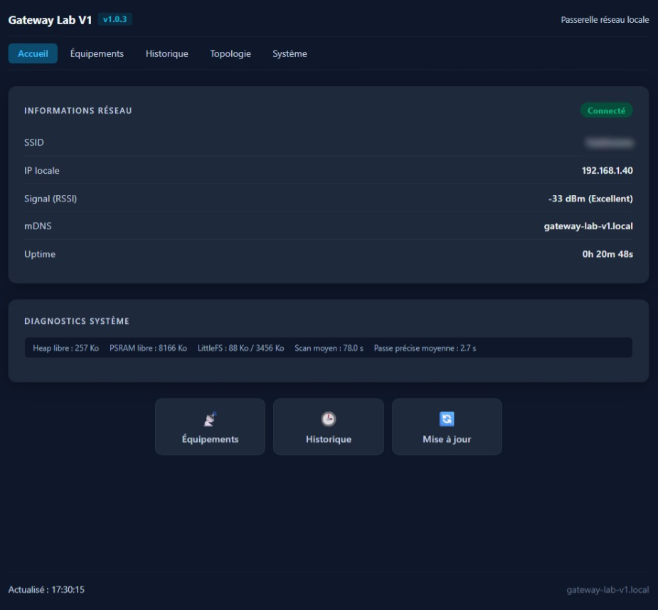
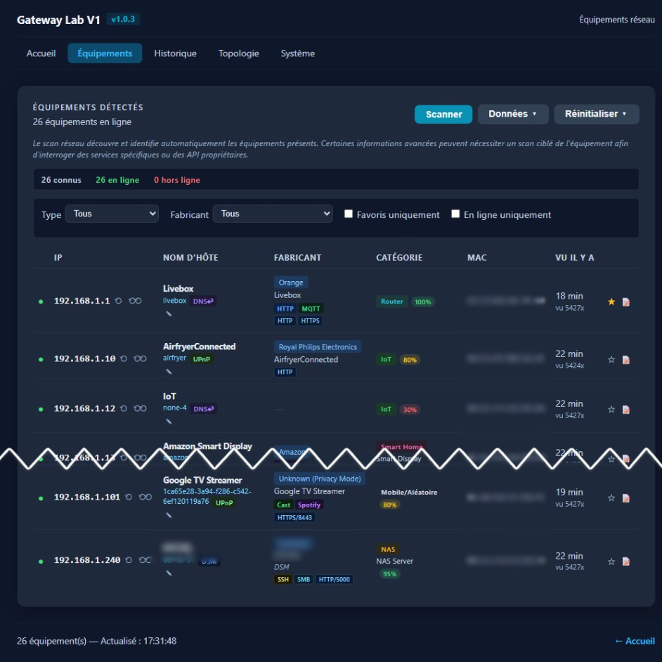
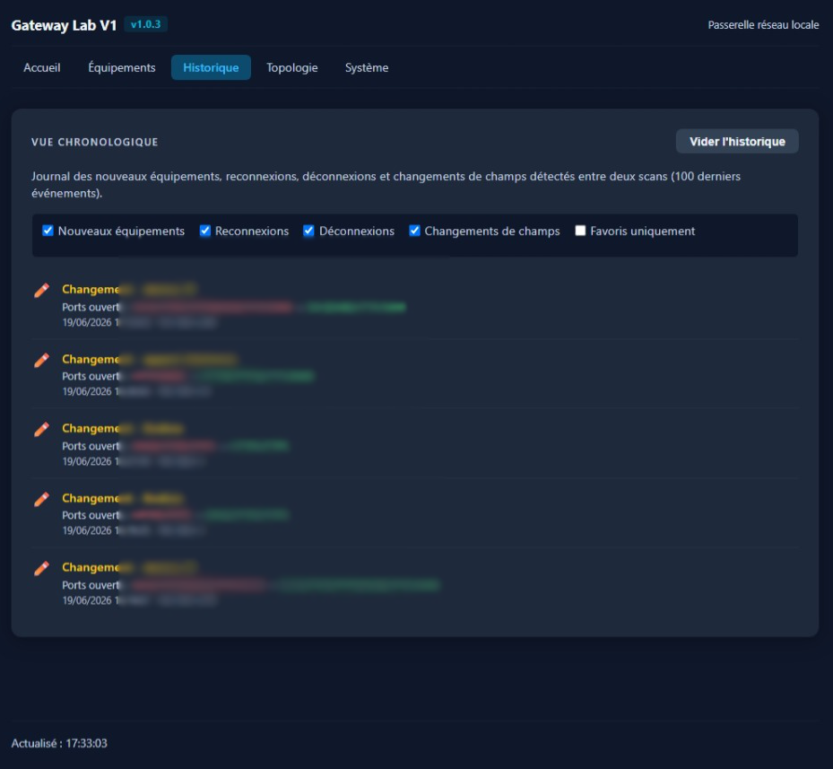
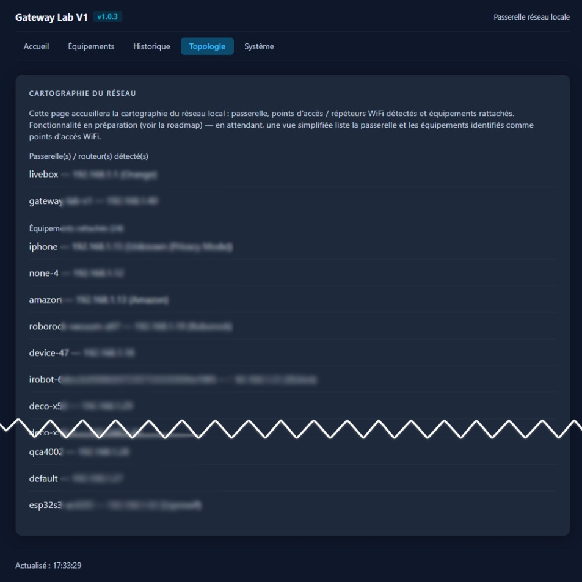
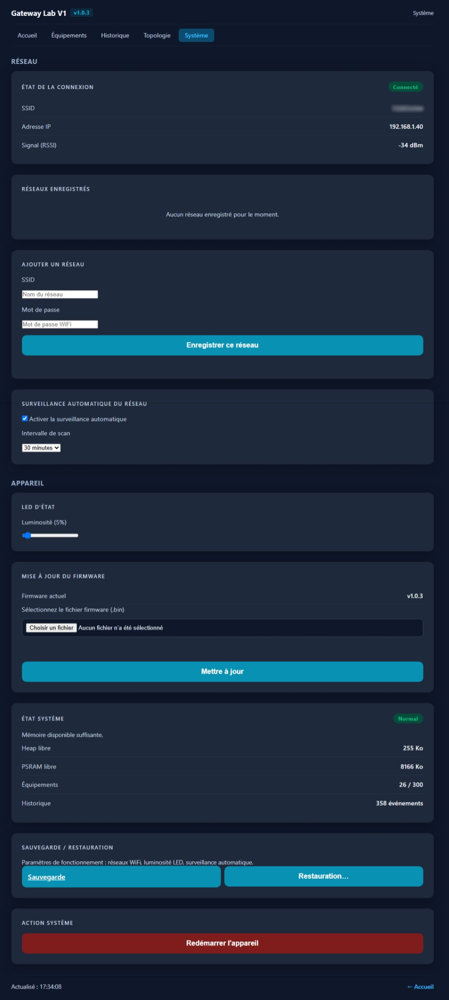

# Gateway Lab


## Autonomous network inventory and discovery appliance powered by ESP32-S3.

Gateway Lab est une passerelle réseau autonome qui découvre, identifie et conserve l'historique des équipements présents sur un réseau local domestique.

Conçu autour d'un ESP32-S3, le projet privilégie la simplicité de déploiement, l'autonomie, la faible consommation et la conservation locale des données.

Principales fonctionnalités
Découverte multi-protocoles (ARP, ICMP, mDNS, SSDP, DNS-SD, NetBIOS...)
Inventaire persistant des équipements détectés
Classification automatique (fabricant, catégorie, type)
Historique des connexions, déconnexions et changements
Favoris et notes utilisateur
Surveillance continue du réseau et score de stabilité par équipement
Export CSV et JSON
Sauvegarde et restauration
Interface web responsive
Mise à jour OTA
Fonctionnement autonome sans cloud
Aperçu de l'interface
### Accueil

Informations réseau, état de connexion, diagnostics système et accès rapide aux principales fonctions.




### Équipements

Inventaire des appareils détectés avec filtres, favoris, notes, niveau de confiance et outils d'administration.




### Historique

Journal chronologique des nouveaux équipements, reconnexions, déconnexions et changements détectés.




### Topologie

Vue simplifiée de la passerelle, des points d'accès détectés et des équipements rattachés.




### Système

Configuration WiFi, gestion des réseaux enregistrés, activation et fréquence
de la surveillance automatique du réseau (5 min → 1 h, Patch 1), réglage de
la NeoPixel d'état, sauvegarde/restauration des paramètres de fonctionnement
(Patch 1), mise à jour du firmware (OTA) et état système (mémoire, nombre
d'équipements, historique).



---

## Présentation

Gateway Lab est un projet personnel développé autour d'un ESP32-S3.

L'objectif est de construire progressivement une passerelle réseau autonome capable de :

* Découvrir automatiquement les équipements présents sur le réseau local
* Identifier les appareils détectés
* Enrichir les informations collectées (nom, fabricant, catégorie, modèle...)
* Fournir une interface web locale simple et légère
* Permettre les mises à jour OTA sans accès physique au matériel
* Servir de laboratoire d'expérimentation autour des protocoles réseau domestiques

Le projet privilégie :

* La simplicité de déploiement
* La maintenabilité du code
* La documentation
* La compréhension des mécanismes réseau

---

## Installation rapide

1. Télécharger le firmware depuis la dernière release GitHub
2. Flasher l'ESP32-S3
3. Se connecter au réseau WiFi `GatewayLab-Setup`
4. Configurer le WiFi depuis le navigateur
5. Accéder à Gateway Lab via `http://gateway-lab.local`

Guide détaillé : voir INSTALLATION.md
Guide développeur : voir docs/DEVELOPMENT.md

---

## Matériel cible

**ESP32-S3 DevKitC-1 N16R8**

* 16 Mo Flash
* 8 Mo PSRAM
* Dual Core 240 MHz

---

## Fonctionnalités actuelles

| Fonctionnalité           | Détail                                                            |
| ------------------------ | ----------------------------------------------------------------- |
| WiFi multi-réseaux       | Connexion automatique au réseau enregistré au meilleur signal     |
| Portail de configuration | Point d'accès `GatewayLab-Setup` + page web si aucun réseau n'est connu |
| Persistance NVS          | Réseaux WiFi enregistrés survivant aux redémarrages/coupures      |
| mDNS                     | Accessible via `gateway-lab.local`                             |
| Interface web            | Pages Accueil / Équipements / Historique / Topologie / Système (réseau WiFi, OTA, état système) |
| Scan réseau LAN          | Sweep ARP du sous-réseau local                                    |
| Tâche FreeRTOS dédiée    | Scan asynchrone sur Core 0                                        |
| Résolution hostnames     | mDNS passif + DNS inverse PTR                                     |
| Détection box FAI        | Orange, Free, SFR, Bouygues                                       |
| Découverte SSDP/UPnP     | M-SEARCH multicast, parsing XML, catégorisation automatique       |
| API Philips Hue Bridge   | Modèle, firmware, sans authentification (`/api/config`)           |
| API Synology DSM         | Confirmation NAS, modèle depuis XML UPnP                          |
| API Freebox              | Modèle exact (Ultra/Pop/Révolution), version FreeboxOS            |
| Découverte DNS-SD        | 31 types de services, badges HTTP/SSH/AirPlay/Cast/Sonos/HomeKit  |
| Découverte NetBIOS       | Node Status (UDP 137) - hostnames PC Windows / Samba              |
| Scan de ports TCP        | 14 ports, bannières HTTP/SSH/FTP, détection API IoT (Shelly/Tasmota/FritzBox) |
| Inventaire réseau        | IP, nom, fabricant, modèle, catégorie, OS, services, ports, MAC, source |
| Nom humain du matériel   | Intitulé déduit (modèle/fabricant/catégorie) affiché au-dessus du hostname brut quand celui-ci reste générique, repris dans l'export JSON (`hostnameDisplay`) — l'export CSV garde le hostname brut sur une seule ligne |
| Auto-détection ESP32     | Le Gateway apparaît dans sa propre liste                          |
| Identification OUI       | Base externalisée générée automatiquement                         |
| Persistance LittleFS     | Statistiques online/offline, état conservé entre redémarrages     |
| Historique des équipements | Synchronisation NTP, firstSeen/lastSeen/seenCount, journal chronologique (`/history`) |
| Alias utilisateur        | Renommage manuel d'un équipement, prioritaire sur le hostname     |
| Classification intelligente | Affine la catégorie d'un équipement à partir de plusieurs signaux |
| Niveau de confiance      | Score 0-100% expliquant la fiabilité de l'identification, par source |
| Détection des changements | Comparaison automatique entre deux scans (IP, fabricant, catégorie, ports...) |
| Sauvegarde / restauration | Export et import JSON complet de l'inventaire et de l'historique |
| Réinitialisation des équipements | RAZ de l'inventaire, avec options de conservation (alias, fabricant connu) |
| Réinterrogation ciblée   | Rafraîchit un seul équipement (IP) sans relancer un scan complet, en deux passes au choix — rapide (1-3s, ARP/ICMP + PTR DNS) ou approfondie (<3s si rien d'exploitable, sinon quelques secondes) — qui n'interrogent jamais que l'IP visée (aucun SSDP, DNS-SD ou WS-Discovery global) ; tâche asynchrone avec barre de progression et journal d'enrichissement affichés sous la ligne de l'équipement |
| Sous-catégorie (`type`)  | Précision du type d'équipement au sein d'une catégorie (ex: Caméra, Imprimante) |
| Score de confiance unique | Calcul prudent (minimum des signaux fabricant/catégorie), avec détail par champ au survol |
| Sondage SNMP             | `sysDescr` (UDP 161) en requête unicast ciblée, lors de la passe précise approfondie (profil Imprimante/Inconnu avec service exploitable) — fabricant/modèle en texte clair |
| API appareils multimédia | Cast, Sonos, Roku, Samsung Smart TV — sondées en requête unicast ciblée, lors de la passe précise approfondie (profil Streaming/Domotique avec service exploitable) |
| Sondage broker MQTT      | CONNECT anonyme + topics `$SYS/broker/version`/`clients/connected`, requête TCP unicast ciblée, lors de la passe précise approfondie (profil Domotique/Inconnu avec port 1883 ouvert) |
| Fingerprinting DHCP passif | Écoute continue des paquets DHCPDISCOVER/REQUEST (UDP 67) des autres équipements — hostname (option 12) et OS déclaré via vendor class (option 60), sans jamais émettre de requête ni ajouter de coût au scan |
| Découverte Matter (DNS-SD) | Détection des appareils Matter commissionnables (`_matterc._udp`) |
| Filtrage de l'historique | Filtres par type d'événement (nouveau, reconnexion, déconnexion, changement) et par favoris uniquement |
| Effacement de l'historique | Vide le journal après téléchargement automatique d'une sauvegarde JSON |
| OTA Web                  | Upload firmware depuis le navigateur                              |
| ArduinoOTA               | Mise à jour réseau depuis PlatformIO                              |
| Favoris et notes d'inventaire | Marquer un équipement en favori et lui attacher des notes libres datées (entretien, firmware, etc.) |
| Cartouche diagnostics    | Heap libre, PSRAM libre, espace LittleFS, temps moyen d'un scan / d'une passe précise — affichée sur la page Accueil |
| NeoPixel d'état          | Bleu pulsé (démarrage), bleu fixe (prêt), vert clignotant (scan), jaune clignotant (nouvel équipement), violet (portail WiFi), cyan (sauvegarde) — luminosité réglable depuis la page Système, persistée |
| Bouton BOOT               | Appui court = lance un scan, maintien 3 s = sauvegarde immédiate |
| Filtres équipements      | Filtre par type, fabricant, favoris uniquement, en ligne uniquement (page Équipements, côté client) |
| Menu Données              | Sur la page Équipements : Export CSV / Export JSON (inventaire) uniquement — la Sauvegarde / Restauration des paramètres de fonctionnement a été déplacée sur la page Système (Patch 1) |
| Sauvegarde des paramètres | Réseaux WiFi enregistrés, luminosité NeoPixel, état et fréquence de la surveillance automatique (`/api/system/backup`, `/api/system/restore`) — distincte de la sauvegarde de l'inventaire, accessible depuis la page Système (Patch 1) |
| Page Topologie           | Vue simplifiée (passerelle/routeurs vs reste des équipements), première étape avant la cartographie graphique (roadmap v0.4.x) |
| Mode dégradé mémoire     | Heap critique (< `HEAP_CRITICAL_BYTES`) → refuse scans/rescans/notes/historique/config sans redémarrer ; inventaire déjà acquis consultable ; redémarrage manuel depuis la page Système |
| Bornes mémoire           | Listes/historique/notes plafonnés (`MAX_TRACKED_DEVICES`, `MAX_HISTORY_EVENTS`, `MAX_NOTES_PER_DEVICE`, `MAX_NOTE_LENGTH`) pour garantir un fonctionnement stable sur la durée |
| Surveillance continue    | Sweep ARP léger périodique (`serviceMonitor()`), activable/désactivable et fréquence configurable de 5 min à 1 h depuis la page Système (persisté NVS, Patch 1) — détection de présence uniquement : aucun scan rapide/approfondi automatique, aucune découverte SSDP/DNS-SD/SNMP lancée hors scan complet ou rescan manuel (Patch 2) |
| Score de stabilité       | Compteurs de présence/absence/reconnexion par équipement, score 0-100% pour les équipements fixes (équipements mobiles non pénalisés), évènements d'historique (`reconnected`, `disappeared`, `identification_improved`, `mobile_left`, `mobile_returned`, `offline_brief`) |
| Historique sans bruit (Patch 1.1.1) | Absences courtes (<30 min) d'un mobile journalisées (`offline_brief`) en plus du `reconnected` qui suit ; chaînes de reconnexions sans déconnexion explicite regroupées sur la page Historique en une seule entrée « Connexion instable détectée » |
| Classification mobile/fixe | Détection automatique par catégorie/type, override manuel via `POST /api/mobility` |
| Tableau de bord réseau   | `GET /api/network/health` : équipements présents/connus, nouveautés/reconnexions/instabilités des dernières 24h, classement des équipements les moins stables |
| API REST                 | `/api/status`, `/api/devices`, `/api/devices/reset`, `/api/devices/rescan`, `/api/devices/rescan/status`, `/api/scan`, `/api/alias`, `/api/favorite`, `/api/notes`, `/api/diagnostics`, `/api/history`, `/api/backup`, `/api/restore`, `/api/devices/export.csv`, `/api/system/backup`, `/api/system/restore`, `/api/system/health`, `/api/system/restart`, `/api/wifi`, `/api/led/brightness`, `/api/mobility`, `/api/network/health`, `/api/monitor` |

---

## Démarrage rapide

### 1. Configurer le WiFi

**Utilisateur final** (firmware déjà flashé, `gateway-lab.bin`) : aucune
étape requise — connectez-vous au point d'accès `GatewayLab-Setup` au premier
démarrage et suivez le portail de configuration. Détail complet dans INSTALLATION.md
Fonctionnement avancé : docs/WIFI_SETUP.md

**Développeur** (build local, pour éviter de ressaisir le WiFi à chaque
flash) : copier

```text
include/secrets_example.h
```

vers :

```text
include/secrets.h
```

Puis renseigner un réseau de développement :

```cpp
#define DEFAULT_WIFI_SSID     "MonSSID"
#define DEFAULT_WIFI_PASSWORD "MotDePasse"
```

Ce réseau n'est utilisé que si aucun réseau n'est encore enregistré en
mémoire NVS de l'ESP32 (priorité à la configuration utilisateur).

⚠️ `include/secrets.h` est ignoré par Git et ne doit jamais être commité.

---

### 2. Générer les assets web

```bash
python tools/minify_web.py
```

---

### 3. Compiler et flasher

```bash
pio run --target upload
```

---

### 4. Accéder à l'interface

```text
http://gateway-lab.local
```

ou via l'adresse IP affichée sur la page d'accueil ou la page Système.

---

## Structure du projet

```text
Gateway-Lab-V1/
├── src/
│   ├── main.cpp
│   │
│   ├── modules/
│   │   ├── wifi_manager.*
│   │   ├── ota_manager.*
│   │   ├── web_server.*
│   │   ├── network_scanner.*
│   │   ├── hostname_resolver.*
│   │   ├── isp_detector.h
│   │   ├── ssdp_scanner.*
│   │   ├── dns_sd_scanner.*
│   │   ├── netbios_scanner.*
│   │   ├── port_scanner.*
│   │   ├── snmp_scanner.*
│   │   ├── ws_discovery_scanner.*
│   │   ├── media_api_scanner.*
│   │   ├── device_enricher.h
│   │   ├── device_store.*
│   │   ├── device_history.*
│   │   ├── system_health.*
│   │   └── time_sync.*
│   │
│   └── utils/
│       └── logger.h
│
├── include/
│   ├── app_config.h
│   ├── board_config.h
│   ├── secrets_example.h
│   ├── secrets.h                # Non versionné
│   ├── oui_table.h              # Généré depuis data/oui.json
│   ├── web_interface.h          # Généré depuis web_src/index.html
│   ├── web_interface_scan.h     # Généré depuis web_src/scan.html
│   ├── web_interface_history.h  # Généré depuis web_src/history.html
│   ├── web_interface_wifi.h     # Généré depuis web_src/wifi.html (page Système)
│   └── web_interface_topology.h # Généré depuis web_src/topology.html
│
├── web_src/
│   ├── index.html                # Page d'accueil — HTML uniquement (source)
│   ├── index.js                  # Script de la page d'accueil (source)
│   ├── scan.html                 # Page équipements — HTML uniquement (source)
│   ├── scan.js                   # Script de la page équipements (source)
│   ├── history.html              # Page historique — HTML uniquement (source)
│   ├── history.js                # Script de la page historique (source)
│   ├── wifi.html                 # Page Système (WiFi, OTA, état système) — HTML uniquement (source)
│   ├── wifi.js                   # Script de la page Système (source)
│   ├── topology.html             # Page Topologie — HTML uniquement (source)
│   ├── topology.js               # Script de la page Topologie (source)
│   ├── menu.html                 # Bloc <nav> partagé, inliné dans toutes les pages (source)
│   ├── styles.css                # Feuille de style unique (injectée inline par minify_web.py)
│   ├── template.html             # Gabarit de référence (documentation)
│   ├── extracted/                # Sortie de extract_web_sources.py (non versionné)
│   └── README.md                 # Guide développeur web_src/
│
├── data/
│   ├── oui.json                 # Base OUI source
│   └── index.html
│
├── docs/
│   ├── ARCHITECTURE.md
│   ├── DEVELOPMENT.md
│   ├── PROTOCOLS.md
│   ├── WARNINGS.md
│   ├── WIFI_SETUP.md
│   └── pictures/
│
├── tools/
│   ├── minify_web.py
│   ├── extract_web_sources.py
│   └── validate_html.py
│
├── test/
│
├── CHANGELOG.md
├── CONTRIBUTING.md
├── INSTALLATION.md
├── LICENSE
├── ROADMAP.md
├── README.md
└── platformio.ini
```
### Fichiers générés

Les fichiers suivants sont générés automatiquement et versionnés dans Git :

```text
include/oui_table.h
include/web_interface.h
include/web_interface_scan.h
include/web_interface_ota.h
include/web_interface_history.h
include/web_interface_wifi.h
include/web_interface_topology.h
```

Ils sont reconstruits à partir de :

```text
data/oui.json
web_src/*.html
web_src/*.js
```

via :

```bash
python tools/minify_web.py
```

---

## Workflow de développement web

Chaque page web est découpée en trois sources, qui ont chacune un rôle unique :

* `web_src/styles.css` → **tout** le CSS commun (une seule feuille pour les 6 pages)
* `web_src/*.html` → uniquement du HTML/markup (aucun style, aucun script inline)
* `web_src/*.js` → uniquement le JavaScript de la page correspondante

```text
web_src/styles.css     ──┐
web_src/index.html     ──┤
web_src/index.js       ──┤
web_src/scan.html      ──┤
web_src/scan.js        ──┤
web_src/ota.html       ──┼── python tools/minify_web.py ──► include/*.h ──► pio run
web_src/ota.js         ──┤
web_src/history.html   ──┤
web_src/history.js     ──┤
web_src/wifi.html      ──┤
web_src/wifi.js        ──┤
web_src/topology.html  ──┤
web_src/topology.js    ──┘
```

`minify_web.py` minifie le CSS et le JS, puis les injecte **inline** dans chaque
page (à la place du `<link rel="stylesheet">` et du `<script src="...">`) avant
de générer le header C++ correspondant. Résultat : l'ESP32 sert chaque page comme
un seul fichier HTML auto-contenu depuis la mémoire flash (PROGMEM), sans serveur
de fichiers statiques.

Note : la page du **portail de configuration WiFi** (`GatewayLab-Setup`,
servie uniquement en mode point d'accès) est une exception volontaire : son
HTML est défini directement dans `src/modules/wifi_manager.cpp`, car elle
doit pouvoir s'afficher avant toute connexion réseau, indépendamment du
pipeline `web_src/`.

Les headers générés sont versionnés dans Git — aucun pre-script PlatformIO requis.

### Outils disponibles

| Outil | Usage |
|---|---|
| `python tools/minify_web.py` | Génère les headers PROGMEM depuis `web_src/` et `data/oui.json` |
| `python tools/validate_html.py` | Valide la structure HTML des 6 pages + gabarit |
| `python tools/extract_web_sources.py` | Prévisualise l'extraction des headers → `web_src/extracted/` (dry-run) |
| `python tools/extract_web_sources.py --force` | Récupération d'urgence : écrit le HTML/JS extrait des headers dans `web_src/extracted/` (sans jamais toucher aux sources originales de `web_src/`) |

---

## API REST

### GET /

Page d'accueil

### GET /scan

Inventaire réseau

### GET /history

Vue chronologique des événements détectés

### GET /wifi

Page Système : réseau WiFi (état de connexion, réseaux enregistrés), LED
d'état, mise à jour du firmware (OTA) et état système (mémoire, équipements,
historique).

### GET /topology

Page Topologie : vue simplifiée (passerelle/routeurs détectés vs reste des
équipements), à partir des données déjà collectées par le scan. Première
étape avant la cartographie graphique prévue en roadmap (v0.4.x).

### GET /api/status

Retourne :

```json
{
  "ssid": "...",
  "ip": "...",
  "rssi": -42,
  "uptime": "...",
  "version": "...",
  "hostname": "...",
  "scanning": false
}
```

### GET /api/devices

Retourne :

```json
{
  "scanning": false,
  "devices": [...]
}
```

### POST /api/scan

Déclenche un scan réseau asynchrone.

### POST /api/alias

Définit ou efface l'alias d'un équipement (paramètres `mac` et `alias`).

### POST /api/devices/reset

RAZ de l'inventaire des équipements connus. Paramètres optionnels
`keepAlias` et `keepManufacturer` (`1`/`0`) pour conserver les équipements
disposant d'un alias et/ou d'un fabricant identifié.

### POST /api/devices/rescan

Réinterroge un seul équipement (paramètre `ip`) sans relancer un scan
complet, et sans jamais relancer de découverte multicast réseau (aucun
SSDP, DNS-SD ou WS-Discovery global n'est lancé depuis cette route — ce
sont des protocoles qui sondent tout le sous-réseau et ne peuvent pas être
restreints à une IP). Sonde ARP/ICMP ciblée, puis résolution de nom ;
paramètre `mode` optionnel :
- `quick` (par défaut, 1-3s) : ARP/ICMP, PTR DNS, mise à jour du
  hostname, vérification de présence — rien d'autre.
- `deep` (<3s si rien d'exploitable, sinon quelques secondes) : scan TCP
  unicast des ports de la cible (`kRescanTargetPorts`). Si aucun
  port/service exploitable n'est trouvé, la passe s'arrête immédiatement.
  Sinon, le profil d'équipement (Computer, NAS, Printer, Streaming,
  SmartHome, Mobile, Unknown) est déduit des ports découverts et seuls les
  modules pertinents pour ce profil sont lancés, toujours en requête
  unicast directe sur l'IP visée : NetBIOS, API multimédia
  (Cast/Sonos/Roku/Samsung) et SNMP.

Exécuté de façon asynchrone sur une tâche FreeRTOS dédiée — voir
`GET /api/devices/rescan/status` pour suivre la progression. Retourne une
erreur 409 si un scan complet ou une autre passe précise est déjà en
cours, ou 400 si l'IP est inconnue.

### GET /api/devices/rescan/status

Retourne l'état courant de la passe précise en cours (à interroger toutes
les 500 ms par l'interface) :

```json
{
  "running": true,
  "ok": false,
  "ip": "192.168.1.42",
  "step": "Services multimédia",
  "percent": 70,
  "mode": "deep",
  "profile": "Streaming",
  "log": ["Modèle détecté : Google Nest Hub", "Confiance : 30% → 70%"]
}
```

`running` repasse à `false` une fois la passe terminée ; `ok` indique si
l'équipement a répondu. `mode` et `profile` indiquent la passe et le
profil déduit pour cette réinterrogation. `log` contient le journal
d'enrichissement de la dernière passe terminée (ou
`["Aucune information supplémentaire détectée"]` si rien de nouveau n'a
été trouvé).

### POST /api/favorite

Marque ou démarque un équipement comme favori (paramètres `mac` ou `ip`,
et `favorite` : `1` pour marquer, `0` pour démarquer).

### POST /api/notes

Ajoute une note libre datée à un équipement (paramètres `mac` ou `ip`, et
`text`). Le timestamp (`ts`, epoch NTP) est attribué côté serveur — `0` si
l'horloge n'est pas encore synchronisée.

### DELETE /api/notes

Supprime une note d'un équipement (paramètres `mac` ou `ip`, et `ts` —
le timestamp de la note à supprimer).

### GET /api/diagnostics

Retourne l'état mémoire/stockage, les temps de scan moyens et les compteurs
affichés sur la page Système :

```json
{
  "freeHeap": 184320,
  "freePsram": 7340032,
  "fsUsedBytes": 12480,
  "fsTotalBytes": 1474560,
  "lastScanMs": 4210,
  "avgScanMs": 3980,
  "lastRescanMs": 1850,
  "avgRescanMs": 1720,
  "degraded": false,
  "degradedReason": "",
  "deviceCount": 23,
  "maxDevices": 64,
  "historyCount": 84
}
```

### GET /api/history

Retourne le journal chronologique des événements (les plus récents en premier).

### DELETE /api/history

Vide le journal chronologique. L'interface web télécharge une sauvegarde
JSON du journal avant d'appeler cette route.

### GET /api/backup

Télécharge un export JSON complet de l'inventaire, des alias et de l'historique.

### POST /api/restore

Restaure l'inventaire depuis un export JSON précédemment généré par `/api/backup`.

### GET /api/devices/export.csv

Télécharge l'inventaire au format CSV (une ligne par équipement : IP, MAC,
hôte, alias, fabricant, modèle, catégorie, type, OS, services, ports
ouverts, en ligne (`Yes`/`No`), favori (`Yes`/`No`), niveau de confiance,
notes utilisateur, première/dernière apparition (date lisible
`AAAA-MM-JJ HH:MM:SS`), compteur de vues). Chaque équipement occupe
exactement une ligne physique : tout retour à la ligne présent dans une
valeur (note libre saisie par l'utilisateur, hostname...) est aplati en
espace avant export, pour rester lisible même par un tableur ou un script
qui ne respecte pas les guillemets RFC4180. Utile pour une exploitation dans
un tableur ou un script externe — pour une sauvegarde/restauration complète
(format JSON, dates en epoch), utiliser `/api/backup`. Le fichier contient un
BOM UTF-8 en tête pour un affichage correct des accents dans Excel.

### GET /api/system/backup

Télécharge une sauvegarde JSON des **paramètres de fonctionnement du
projet** — distincte de `/api/backup` (qui sauvegarde l'inventaire des
équipements) : réseaux WiFi enregistrés (SSID + mot de passe), luminosité
NeoPixel, état et fréquence de la surveillance automatique du réseau
(`monitorEnabled`, `monitorIntervalMinutes` — Patch 1), et nom mDNS à titre
informatif (fixé à la compilation via `MDNS_HOSTNAME`, non restaurable).
Accessible depuis la carte « Sauvegarde / Restauration » de la page Système.

### POST /api/system/restore

Restaure les paramètres de fonctionnement depuis un export JSON généré par
`/api/system/backup`. Les réseaux WiFi du fichier sont ajoutés ou mis à jour
(jamais supprimés automatiquement) ; la luminosité NeoPixel et l'état/fréquence
de la surveillance automatique sont appliqués immédiatement si présents dans
le fichier.

### GET /api/system/health

Retourne l'état du mode dégradé mémoire :

```json
{
  "degraded": false,
  "reason": "",
  "freeHeap": 184320
}
```

`degraded=true` quand le heap libre est tombé sous `HEAP_CRITICAL_BYTES` —
les nouveaux scans, rescans, notes, journalisation d'historique et
modifications de configuration sont alors refusés jusqu'à ce que la mémoire
se rétablisse (`HEAP_RECOVERY_MARGIN`) ou qu'un redémarrage manuel soit
effectué.

### POST /api/system/restart

Redémarre l'ESP32 immédiatement (déclenché manuellement depuis le bouton
« Redémarrer l'appareil » de la page Système — aucun redémarrage
automatique n'est déclenché par le firmware lui-même).

### POST /update

Upload d'un firmware `.bin` (formulaire intégré à la page Système, `/wifi`).

### GET /api/led/brightness

Retourne la luminosité courante de la NeoPixel d'état : `{"brightness": 15}`.

### POST /api/led/brightness

Définit la luminosité (paramètre `value`, 0-100), persistée en NVS.

### GET /api/wifi

Retourne :

```json
{
  "connected": true,
  "ssid": "...",
  "ip": "...",
  "rssi": -42,
  "networks": [{"ssid": "Maison"}, {"ssid": "Atelier"}]
}
```

Les mots de passe enregistrés ne sont jamais renvoyés au navigateur.

### POST /api/wifi

Ajoute ou met à jour un réseau enregistré (paramètres `ssid` et `password`).

### DELETE /api/wifi

Supprime un réseau enregistré (paramètre `ssid`).

### POST /api/mobility

Force ou efface la classification mobile/fixe d'un équipement (paramètres
`mac` ou `ip`, et `mode` : vide pour revenir à la détection automatique,
`fixed` ou `mobile` pour forcer).

### GET /api/network/health

Tableau de bord réseau de la surveillance continue : équipements
présents/connus, compteurs des dernières 24h (nouveaux équipements,
reconnexions, instabilités) et classement des équipements les moins
stables (score de stabilité, équipements mobiles exclus).

### GET /api/monitor

Retourne l'état courant de la surveillance continue :
`{"enabled": true, "intervalMinutes": 5}`. Réglable depuis la page Système
(case d'activation + sélecteur 5 min → 1 h, Patch 1).

### POST /api/monitor

Définit l'état de la surveillance continue : paramètres optionnels `enabled`
(`1`/`0`/`true`/`false`) et `minutes` (borné à 1-60 côté API ; l'interface
propose 5/10/15/30/60 min), persistés en NVS. Lorsque `enabled=false`, la
surveillance ne fait plus aucun tick (Patch 1). Quand elle est active, elle
se limite à un sweep ARP de détection de présence — aucun scan rapide ou
approfondi n'est plus déclenché automatiquement (Patch 2) ; pour une
identification complète, lancer un scan manuel (`/scan`) ou une passe
précise sur un équipement (`/api/devices/rescan`).

---

## Sources d'identification

Les informations affichées peuvent provenir de plusieurs mécanismes :

| Source       | Badge UI  | Description                                                     |
| ------------ | --------- | --------------------------------------------------------------- |
| OUI          | —         | Fabricant déduit de l'adresse MAC (base locale `data/oui.json`) |
| PTR          | `DNS↩`   | DNS inverse fourni par la box DHCP                              |
| mDNS         | `mDNS`    | Annonce `.local` captée passivement                             |
| SSDP         | `UPnP`    | Descripteur XML UPnP (M-SEARCH multicast)                       |
| HueAPI       | `Hue`     | API Philips Hue Bridge `/api/config`                            |
| SynologyAPI  | `DSM`     | API Synology DSM `/webapi/query.cgi`                            |
| FreeboxAPI   | `Freebox` | API Freebox `/api_version`                                      |
| NetBIOS      | `NetBIOS` | Node Status NetBIOS (UDP 137) - PC Windows / Samba              |
| SNMP         | `SNMP`    | `sysDescr` SNMP (UDP 161), requête unicast ciblée (passe précise approfondie) |
| Cast         | `Cast`    | API Google Cast `/setup/eureka_info`, requête unicast ciblée (passe précise approfondie) |
| Sonos        | `Sonos`   | API Sonos `/xml/device_description.xml`, requête unicast ciblée (passe précise approfondie) |
| Roku         | `Roku`    | API Roku `/query/device-info`, requête unicast ciblée (passe précise approfondie) |
| SamsungTV    | `Samsung` | API Samsung Smart TV `/api/v2/`, requête unicast ciblée (passe précise approfondie) |
| MQTT         | `MQTT`    | Broker MQTT (port 1883), CONNECT + topics `$SYS/broker/*`, requête unicast ciblée (passe précise approfondie) |
| DHCP         | `DHCP`    | Hostname résolu via fingerprinting DHCP passif (option 12, UDP 67), écoute continue sans requête |
| Self         | `ESP32`   | Informations de l'ESP32 lui-même                                |

---

## Documentation

| Fichier | Description |
|----------|-------------|
| INSTALLATION.md | Installation et première configuration |
| docs/DEVELOPMENT.md | Compilation, flash et développement |
| docs/WIFI_SETUP.md | Fonctionnement détaillé du portail WiFi |
| docs/ARCHITECTURE.md | Architecture interne du projet |
| docs/PROTOCOLS.md | Protocoles réseau utilisés |
| docs/WARNINGS.md | Limitations connues |
| CHANGELOG.md | Historique des versions |
| ROADMAP.md | Évolutions prévues |

---

## Évolution du projet

Le développement suit une progression volontaire :

1. Découvrir les équipements du réseau
2. Identifier les équipements détectés
3. Comprendre les services qu'ils exposent
4. Construire une cartographie logique du réseau
5. Interagir avec les équipements compatibles

Pour les fonctionnalités prévues, consulter `ROADMAP.md`.

---

## Contraintes de développement

- `include/board_config.h` — ne pas modifier
- `include/secrets.h` — ne jamais committer
- CSS modifiable uniquement dans `web_src/styles.css`
- Largeur de page : toutes les pages utilisent la classe `page-scan`
  (max-width 960px) pour une largeur uniforme ; seule la page Équipements
  exploite réellement cette largeur pour son tableau (les autres pages
  l'utilisent simplement pour aligner leur carte sur la même largeur)
- HTML modifiable uniquement dans `web_src/*.html` (jamais de `<style>` ou `<script>` inline)
- JavaScript modifiable uniquement dans `web_src/*.js`
- Versioning uniquement dans `platformio.ini` via `PROJECT_VERSION`
- Après toute modification de `web_src/` ou `data/oui.json` → relancer `python tools/minify_web.py`

## Licence

Projet personnel open source publié à des fins d'apprentissage, d'expérimentation et de partage de connaissances autour de l'ESP32, du réseau et des systèmes embarqués.
